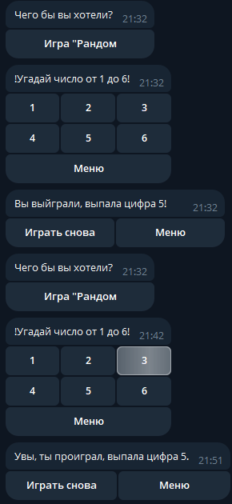

This is a Telegram bot.
It was created for entertainment and educational purposes, and anyone is free to use it.
The bot centers around a game called "Random." In the game, a random number is generated, and you are presented with a choice of six numbers.
If you guess the correct number, a "win" menu appears; otherwise, a "loss" menu is displayed.
All messages appear on a new line rather than overwriting previous ones.

Enjoy using it!
